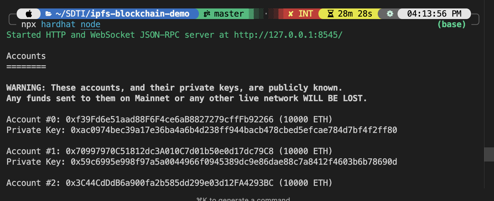

# IPFS Blockchain Demo

This project demonstrates decentralized storage using IPFS and the Ethereum blockchain with Hardhat. It uploads a file to IPFS, retrieves its CID, stores the CID in a smart contract, and interacts with the contract to read/write the CID.

## Author

- Mohamed Lakssir

## Prerequisites

- Node.js (>=20.0.0) and npm
- pnpm (install with `npm install -g pnpm`)
- Hardhat (install with `pnpm install --save-dev hardhat`)
- IPFS CLI or Docker for the IPFS node
- Docker Compose (for local IPFS node)

## Setup

1. **Clone Repository:**

   ```bash
   git clone <repository-url>
   cd ipfs-blockchain-demo
   ```

2. **Install Dependencies:**

   ```bash
   pnpm install
   ```

3. **Run Local IPFS Node:**
   Create a `docker-compose.yml` file:

   ```yaml
   services:
     ipfs:
       image: ipfs/kubo:latest
       container_name: ipfs-node
       ports:
         - "4001:4001" # Peer-to-peer
         - "5001:5001" # API (used for interaction with ipfs-http-client)
         - "8080:8080" # Public gateway
       volumes:
         - ipfs_staging:/export
         - ipfs_data:/data/ipfs
       restart: unless-stopped
       command: daemon --migrate

   volumes:
     ipfs_staging:
     ipfs_data:
   ```

4. **Start IPFS:**

   ```bash
   docker-compose up -d
   ```

## Usage

1. **Upload File to IPFS:**
   Create a file (`fichier.txt`):

   ```bash
   echo "Bonjour IPFS + Blockchain" > fichier.txt
   ```

2. **Run upload script to upload and get CID:**

   ```bash
   node scripts/uploadToIPFS.js
   ```

3. **Start Hardhat Node:**

   ```bash
   npx hardhat node
   ```

4. **Deploy Smart Contract:**

   ```bash
   npx hardhat run scripts/deploy.js --network localhost
   ```

   Note the contract address (e.g., `0x5FbDB2315678afecb367f032d93F642f64180aa3`).

5. **Interact with Contract:**
   Update `scripts/interact.js` with the deployed contract address, then run:

   ```bash
   npx hardhat run scripts/interact.js --network localhost
   ```

   Expected output:

   ```shel
   Stored CID: QmT5NvUtoM5nZHUW2pZXEjrScpRr4V6kgwYZin13uA5fXZ
   ```

## Project Structure

- `contracts/IPFSStorage.sol`: Smart contract for storing/retrieving IPFS CID.
- `scripts/deploy.js`: Deploys the smart contract.
- `scripts/interact.js`: Interacts with the deployed contract to set/get CID.
- `scripts/uploadToIPFS.js`: Uploads a file to IPFS and retrieves its CID.
- `hardhat.config.js`: Hardhat configuration.
- `package.json`: Project dependencies and scripts.
- `LICENSE`: The license under which the project is distributed.
- `SECURITY.md`: Security policy and reporting guidelines for vulnerabilities.

## Screenshots

Here are some screenshots demonstrating the functionality of the project:

1. **View of Output Node**  
   

2. **Overview of Docker IPFS Node**  
   

3. **View of Output of Deploy**  
   

4. **View of Output of interact.js**  
   

## Troubleshooting

- Ensure the Hardhat node is running (`http://127.0.0.1:8545`).
- Verify the contract address in `interact.js`.
- Check IPFS node connectivity (`http://localhost:5001`).
- Reinstall dependencies if errors occur:

  ```bash
  rm -rf node_modules pnpm-lock.yaml
  pnpm install
  ```

## License

This project is licensed under the MIT License. See the [LICENSE](LICENSE) file for details.

## Security

For information on security vulnerabilities, please refer to the [SECURITY.md](SECURITY.md) file.
